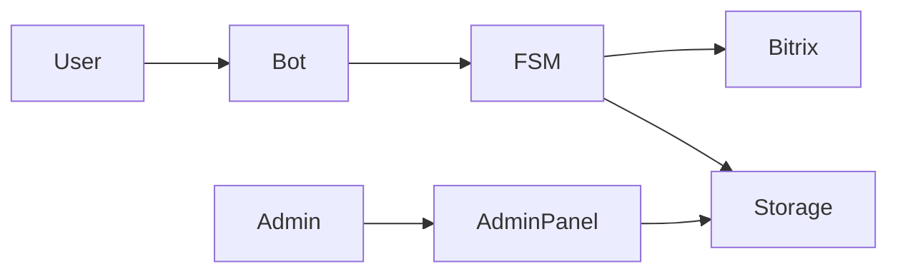

# Internal Support Telegram Bot

Production-бот, используемый внутри компании как основная точка коммуникации между сотрудниками и службой поддержки.
Используется как единая точка приёма жалоб и заявок от 4500+ сотрудников.

Бот автоматизирует полный цикл обработки обращений: сотрудник → оформление заявки → регистрация → маршрутизация → работа с обращением в Bitrix24 → аналитика и экспорт.

---

## Описание проекта

Проект представляет собой полнофункционального Telegram-бота для внутреннего использования в компании. Бот реализует многошаговую FSM-форму сбора обращений от сотрудников, обеспечивает валидацию данных, поддержку вложений, мультиязычность, а также интеграцию с корпоративной системой управления задачами Bitrix24. Проект рассчитан на реальную эксплуатацию в производственной среде.


## Архитектурная схема




---

## 🧩 Основные возможности
- Многошаговые формы (FSM)
- Три языка: RU / UZ / EN
- Загрузка фото, видео, файлов
- Админ-панель для обработки заявок
- Интеграция с Bitrix24
- Экспорт статистики
- Уведомления и логирование

---

## Сценарий работы пользователя

1. Запуск бота через команду /start.
2. Выбор языка интерфейса.
3. Подтверждение согласия на обработку персональных данных.
4. Ввод ФИО с автоматической валидацией.
5. Ввод номера телефона.
6. Выбор категории обращения.
7. Ввод текста обращения.
8. Прикрепление вложений при необходимости.
9. Проверка и подтверждение карточки обращения.
10. Регистрация обращения и отправка в систему поддержки.

---

## Сценарий администратора

Административные команды доступны пользователям, указанным в списке ADMIN_IDS. Администратор может просматривать обращения, выполнять фильтрацию по периоду, экспортировать данные в CSV и контролировать статус интеграции с Bitrix24.

---

## Установка и запуск (Windows)

### 1. Клонирование репозитория

Откройте PowerShell или командную строку и выполните:

```
git clone https://github.com/RiobVO/project_roote.git
cd project_roote
```

---

### 2. Создание виртуального окружения и установка зависимостей

```
python -m venv .venv
.venv\Scripts\activate
pip install -r requirements.txt
```

---

### 3. Настройка переменных окружения

Скопируйте файл примера:

```
copy app\.env.example app\.env.dev
```

Откройте файл app.env.dev и заполните необходимые значения.

---

### 4. Запуск бота

```
python app\main.py
```

---

## Конфигурация (.env)

Проект использует файл app.env.dev для локальной разработки и файл .env для продакшена.

Пример конфигурации:

```
BOT_TOKEN=your_telegram_bot_token
SUPPORT_CHAT_ID=-1001234567890
ADMIN_IDS=123456789,987654321
ID_PREFIX=DEV
EXPORT_LOOKBACK=200
BITRIX_WEBHOOK_BASE=https://your-domain.bitrix24.ru/rest/1/xxxxxxxxx/
BITRIX_RESPONSIBLE_ID=1
BITRIX_MODE=TASKS
```

---

## Dev и Production режимы

Проект поддерживает раздельную работу в dev- и production-режимах с использованием разных токенов, чатов и параметров Bitrix24. Это обеспечивает безопасную разработку и тестирование без воздействия на рабочую среду.

---

## Технологический стек

* Python 3.10+
* aiogram
* Bitrix24 Webhook API
* python-dotenv
* FSM

---

## 📂 Архитектура проекта

```
app/
  bot_core.py
  config.py
  handlers_user.py
  handlers_admin.py
  keyboards.py
  localization.py
  states.py
  helpers.py
  bitrix_api.py
  main.py
```

---

## Экспорт и аналитика

Бот поддерживает выгрузку обращений в формате CSV для последующего анализа, формирования отчётности и оценки нагрузки на службы поддержки.


